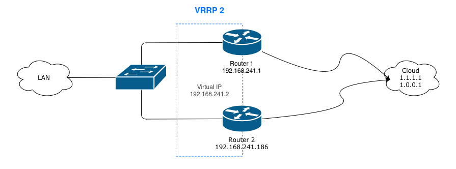
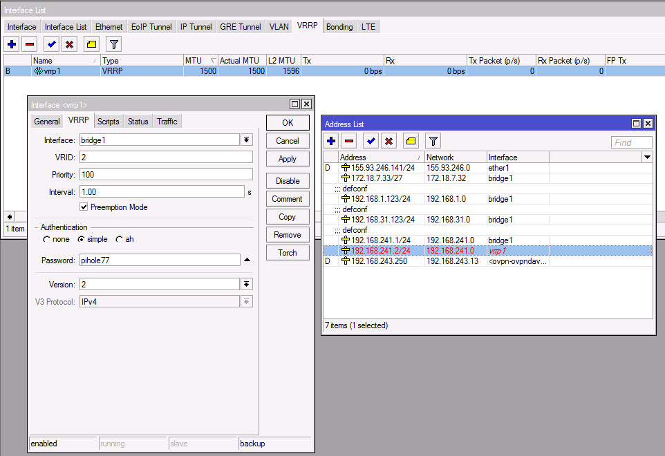

### VRRP



The Virtual Router Redundancy Protocol (VRRP) is a computer networking protocol that provides for automatic assignment of available Internet Protocol (IP) routers to participating hosts. This increases the availability and reliability of routing paths via automatic default gateway selections on an IP subnetwork. 

Reference: [Wikipedia](https://en.wikipedia.org/wiki/Virtual_Router_Redundancy_Protocol)

### Why

I couldn't find a guide on how to do this. There are plenty guides setting up VRRP on RouterOS between two Mikrotik devices, plenty for Cisco, plenty for Linux using Keepalived, and so on and so forth...

And so this guide...

### OK but Why...

Ok but why did I need this you may ask?

In my specific situation, I have a DNS server running [Pi-hole](https://pi-hole.net) which is a Linux network-level advertisement and Internet tracker blocking application which acts as a DNS sinkhole, intended for use on a private network.

What happen is, this runs on a big server, however here in sunny South Africa we at times have power outages, otherwise known as load-shedding or blackouts in other countries over the world. When this happen, the fileserver loses power, but small devices like the Mikrotik Router, Ubiquiti wifi and FTTH ONT stays online...except nothing can resolve DNS when everything is configured to query the [Pi-hole](https://pi-hole.net) server which is now down.

The solution was born, using VRRP to have a floating ip address, which all devices will be configured to use. When the [Pi-hole](https://pi-hole.net) server is online, the IP address will be on there, and block advertisements, and when it goes offline, the Mikrotik router will take over answering DNS queries. The failover happens very quickly, in less than a second.


### RouterOS

On the Mikrotik side, its fairy easy, I will make use of a screenshot to show what is needed.



1. Create a new interface in the VRRP tab
2. Select the LAN interface, bridge1 in my case
3. Choose a VRID, 2 here
4. Priority is 100 (as this will be my backup)
5. Interval is 1.00 for 1 second
6. Setup authentication. I wanted to use 'ah' but settled for 'simple' and you need version 2 for IPv4. Version 3 of VRRP is intended for IPv6.


### Linux

On the Linux OS side, I make use of [Keepalived](https://www.keepalived.org) which can do both virtual ip addresses using VRRP and also simple load-balancing. We will only use the former.

This is the /etc/keepalived/keepalived.conf to match up to the VRRP on the Mikrotik:

```javascript
! Configuration File for keepalived

global_defs {
   router_id LVS_DEVEL
   vrrp_skip_check_adv_addr
}

vrrp_instance VI_1 {
    state BACKUP
    interface eth0
    virtual_router_id 2
    priority 200
    advert_int 1
    authentication {
        auth_type PASS
        auth_pass pihole77
    }
    virtual_ipaddress {
        192.168.241.2/24
    }
}
```

1. Router id matches the Mikrotik
2. Prioty is doubled up to 200 to make this the master
3. advert_int is 1 for 1 second
4. Authentication match up to the Mikrotik


### Slow...

There was one issue I ran in to. [Pi-hole](https://pi-hole.net) service takes a few minutes to start up, mostly combining my huge amount of blacklists from the internet. The problem with this is, if the ip address move over before this complete, I have downtime on the DNS.

The solution to this, [Keepalived](https://www.keepalived.org) isn't set to auto start, but controlled through a very simplisting bash/cron script, that check if we can resolve dns locally on the [Pi-hole](https://pi-hole.net) server before starting up [Keepalived](https://www.keepalived.org).

```bash
#!/bin/bash

DNSCHECK=`dig localhost @192.168.241.186 +short`
#KEEPALIVE=`/etc/init.d/keepalived status | grep started`

if [ $DNSCHECK = '127.0.0.1' ]
then
  echo "DNS IS UP!"
  /etc/init.d/keepalived status | grep started > /dev/null
  if [ $? -ne 0 ]; then
    echo "Keepalive not running, lets start it"
    /etc/init.d/keepalived zap > /dev/null
    /etc/init.d/keepalived start > /dev/null
  fi
else
  echo "DNS IS DOWN!"
  /etc/init.d/keepalived status | grep started > /dev/null
  if [ $? -eq 0 ]; then
    echo "Keepalive is running, lets stop it"
    /etc/init.d/keepalived stop > /dev/null
  fi
fi
```


### END

So there you have it. A little bit of work, but makes for a smooth transition between the Pi-hole server and the Mikrotik router. Let me know in the comments what you think.
