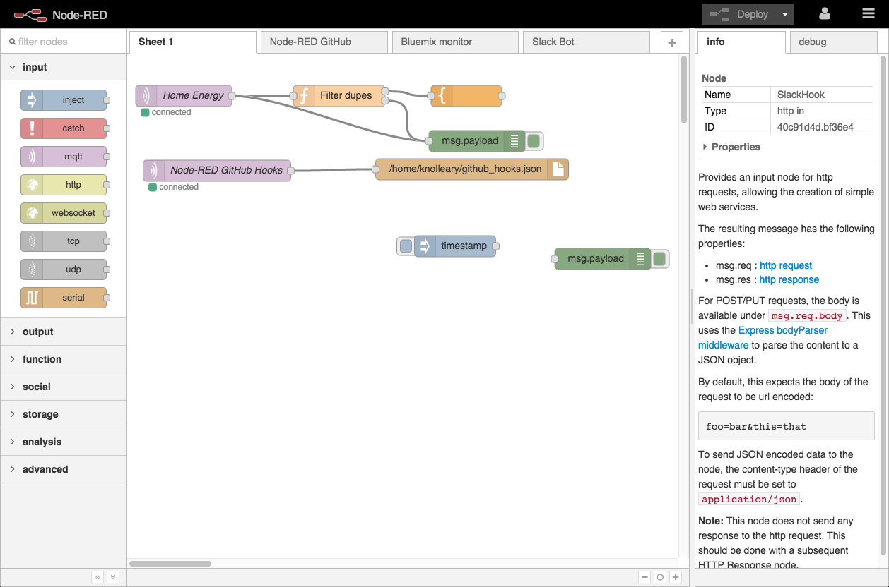

## Node-RED

A visual tool for wiring the Internet of Things.





## Overview

I am planning on writing a series of different posts on using [Node-RED] and so this is the first post of the series. It will have a small twist, in that I will be setting it up using docker-compose with a [Let's Encrypt] certificate using Traefik for the reverse proxy and lastly, [CloudFlare] for DNS.

As a bonus, I will also add [Watchtower] to automate updates of [Traefik] and [Node-Red.]

## Goals

After finishing the instructions in this blog post, you will have:

* Used docker-compose
* [Node-RED] installed without exposing the ports using docker
* [Traefik] installed as reverse-proxy
* Ability to have multiple apps behind unique subdomains on your domain.tld using [Let's Encrypt] certificates

## Requirements

* Linux Host for Docker and [Node-RED] - Can be a VPS or Raspberry Pi ect.
* [CloudFlare] account with [API key](https://support.cloudflare.com/hc/en-us/articles/200167836-Where-do-I-find-my-Cloudflare-API-key-)
* Domain with DNS hosted by [CloudFlare]
* You will need to point a *.domain.tld record to your Linux host. The reason for this is, we will be using subdomains to point to different services running in docker. In this example, I will be pointing nodered.domain.tld to my nodered container for easy access.

## Preperation

Usually I have a separate volume for my data mounted on /data and on this volume I will create a folder named _docker_ with all my files in. 

We will create 2 files /data/docker to start with.

First file will contain our authentication and keys: `.env`

```bash
PUID=1001
PGID=1001
TZ=Africa/Johannesburg
USERDIR=/data

DOMAINNAME=domain.tld
CLOUDFLARE_EMAIL=cloudflare@domain.tld
CLOUDFLARE_API_KEY=abcdefghiklmnopqrstvwxyz01234567897e8c6

HTTP_USERNAME=tinuva
HTTP_PASSWORD=$apr1$bJ77aaaaaaaaaaaaaaaaaaaaaaaaaaax/vO0
API_HTTP_USERNAME=nodered
API_HTTP_PASSWORD=$apr1$bbbbbbbbbbbbbbbbbbbbbbbbbnElz47L1
```
To do:
1. Replace `domain.tld` with your domain that is hosted with [CloudFlare]
2. Set your timezone
3. Create a .htpass file with [HTPASSWD Generator] then place the username and passwords into the above fields.
Initially we will only use the HTTP_USERNAME and HTTP_PASSWORD. The API versions will be used at a later stage when we create an API endpoint using [Node-RED]

Next we will create a `docker-compose.yml` file/

```yaml
version: '2.1'

services:
  nodered:
    image: nodered/node-red-docker:slim-v10
    container_name: nodered
    volumes:
      - ${USERDIR}/docker/nodered/data:/data
      - /etc/localtime:/etc/localtime
    restart: always
    mem_limit: 100m
    cpu_shares: 50
    labels:
      - "traefik.enable=true"
      - "traefik.backend=nodered"
      - "traefik.frontend.redirect.entryPoint=https"
      - "traefik.port=1880"
      - "traefik.protocol=http"
      - "traefik.docker.network=docker_traefik_proxy"
      - "traefik.ifttt.frontend.rule=Host:nodered.${DOMAINNAME};Path:/ifttt"
      - "traefik.ifttt.frontend.auth.basic.users=${API_HTTP_USERNAME}:${API_HTTP_PASSWORD}"
      - "traefik.web.frontend.rule=Host:nodered.${DOMAINNAME}"
      - "traefik.web.frontend.auth.basic.users=${HTTP_USERNAME}:${HTTP_PASSWORD}"
      - com.centurylinklabs.watchtower.enable=true

  traefik:
    hostname: traefik
    image: traefik:latest
    container_name: traefik
    restart: always
    domainname: ${DOMAINNAME}
    cpu_shares: 30
    mem_limit: 250m
    ports:
      - 80:80
      - 443:443
    environment:
      - CLOUDFLARE_EMAIL=${CLOUDFLARE_EMAIL}
      - CLOUDFLARE_API_KEY=${CLOUDFLARE_API_KEY}
    labels:
      - "traefik.enable=true"
      - "traefik.backend=traefik"
      - "traefik.frontend.rule=Host:traefik.${DOMAINNAME}"
      - "traefik.frontend.redirect.entryPoint=https"
      - "traefik.port=8080"
      - "traefik.docker.network=docker_traefik_proxy"
      - "traefik.frontend.auth.basic.users=${HTTP_USERNAME}:${HTTP_PASSWORD}"
      - com.centurylinklabs.watchtower.enable=true
    volumes:
      - /var/run/docker.sock:/var/run/docker.sock:ro
      - ${USERDIR}/docker/traefik:/etc/traefik
      - ${USERDIR}/docker/shared:/shared

  watchtower:
    image: v2tec/watchtower:latest
    container_name: watchtower
    volumes:
      - /var/run/docker.sock:/var/run/docker.sock
      - /etc/localtime:/etc/localtime:ro
    command: --schedule "0 30 5 * * *" --cleanup --label-enable
    restart: always
    mem_limit: 50m
    cpu_shares: 25
```

We also need to create folders and set ownership to match the above.

```bash
mkdir /data/docker/shared
mkdir -p /data/docker/nodered/data
mkdir -p /data/docker/traefik/acme

touch /data/docker/traefik/rules.toml
touch /data/docker/traefik/acme/acme.json
chmod 600 /data/docker/traefik/acme/acme.json

chown -R 1001.1001 /data/docker/nodered
chown -R 1001.1001  /data/docker/traefik
chown 1001.1001  /data/docker/shared
```

Create [Traefik]'s config file: `/data/docker/traefik/traefik.toml`

```toml
#debug = true

logLevel = "ERROR" #DEBUG, INFO, WARN, ERROR, FATAL, PANIC
InsecureSkipVerify = true 
defaultEntryPoints = ["https", "http"]

# WEB interface of Traefik - it will show web page with overview of frontend and backend configurations 
[api]
  entryPoint = "traefik"
  dashboard = true
  address = ":8080"

# Force HTTPS
[entryPoints]
  [entryPoints.http]
  address = ":80"
    [entryPoints.http.redirect]
    entryPoint = "https"
  [entryPoints.https]
  address = ":443"
    [entryPoints.https.tls]

[file]
  watch = true
  filename = "/etc/traefik/rules.toml"

# Let's encrypt configuration
[acme]
email = "email@domain.com" #any email id will work
storage="/etc/traefik/acme/acme.json"
entryPoint = "https"
acmeLogging=true 
onDemand = false #create certificate when container is created
[acme.dnsChallenge]
  provider = "cloudflare"
  delayBeforeCheck = 300
[[acme.domains]]
   main = "domain.tld"
[[acme.domains]]
   main = "*.domain.tld"
   
# Connection to docker host system (docker.sock)
[docker]
endpoint = "unix:///var/run/docker.sock"
domain = "domain.tld"
watch = true
# This will hide all docker containers that don't have explicitly  
# set label to "enable"
exposedbydefault = false
```
Replace/Configure:

1. email@domain.com: with your email.
2. domain.tld: with your private domain name.
3. InsecureSkipVerify = true: I had to add at the beginning to allow some apps (eg. UniFi controller) be accessible through Traefik.
4. provider = "cloudflare": Change to your DNS provider for DNS challenge.
5. exposedbydefault = false: This will force you to use traefik.enable=true label in docker compose to put apps behind traefik.

* If you want to use another DNS provider instead of CloudFlare, review the list of [available providers](https://docs.traefik.io/configuration/acme/#provider) on the Traefik documentation

## Install Docker

Ok lets install docker.

I have a CentOS host which the following work:

```bash
sudo yum install -y yum-utils \
  device-mapper-persistent-data \
  lvm2

sudo yum-config-manager \
    --add-repo \
    https://download.docker.com/linux/centos/docker-ce.repo

sudo yum install docker-ce docker-ce-cli containerd.io

systemctl start docker
systemctl enable docker
```
Reference: https://docs.docker.com/install/linux/docker-ce/centos/

On Ubuntu the commands will be:
```bash
sudo apt-get update

sudo apt-get install \
    apt-transport-https \
    ca-certificates \
    curl \
    gnupg-agent \
    software-properties-common

curl -fsSL https://download.docker.com/linux/ubuntu/gpg | sudo apt-key add -

sudo add-apt-repository \
   "deb [arch=amd64] https://download.docker.com/linux/ubuntu \
   $(lsb_release -cs) \
   stable"

sudo apt-get update

sudo apt-get install docker-ce docker-ce-cli containerd.io
```
Reference: https://docs.docker.com/install/linux/docker-ce/ubuntu/

## Install docker-compose

First confirm `pip` is installed:

On CentOS:
```bash
yum install python-pip
```

On Ubuntu:
```bash
apt install python-pip
```

Then install docker-compose:
```bash
pip install docker-compose
```

## Start containers

Starting the containers is as simple as:

```bash
cd /data/docker && docker-compose up -d --remove-orphans && docker-compose logs -f --tail 10
```

You should see output like the following:
```bash
[root@thor docker]# cd /data/docker && docker-compose up -d --remove-orphans && docker-compose logs -f --tail 10
Pulling traefik (traefik:latest)...
latest: Pulling from library/traefik
d572f7c8e983: Pull complete
d62b0f6adf29: Pull complete
Digest: sha256:02cfdb77b0cd82d973dffb3dafe498283f82399bd75b335797d7f0fe3ebeccb8
Status: Downloaded newer image for traefik:latest
Pulling watchtower (v2tec/watchtower:latest)...
latest: Pulling from v2tec/watchtower
a5415f98d52c: Pull complete
c3f7208ad77c: Pull complete
169c1e589d74: Pull complete
Digest: sha256:4cb6299fe87dcbfe0f13dcc5a11bf44bd9628a4dae0035fecb8cc2b88ff0fc79
Status: Downloaded newer image for v2tec/watchtower:latest
Pulling nodered (nodered/node-red-docker:slim-v10)...
slim-v10: Pulling from nodered/node-red-docker
e7c96db7181b: Pull complete
bbec46749066: Pull complete
89e5cf82282d: Pull complete
5de6895db72f: Pull complete
6c5493c0ae88: Pull complete
6ace8e934b90: Pull complete
e37b30d9d482: Pull complete
95734c8da825: Pull complete
cf430c1fac0c: Pull complete
Digest: sha256:42126aab7325a3133f47e0a89bb14a3985c8d4daeb8d8a3c0e19cfe9137e1c79
Status: Downloaded newer image for nodered/node-red-docker:slim-v10
Creating traefik    ... done
Creating nodered    ... done
Creating watchtower ... done
Attaching to nodered, watchtower, traefik
nodered       |
nodered       | > node-red-docker@1.0.0 start /usr/src/node-red
nodered       | > node $NODE_OPTIONS node_modules/node-red/red.js -v $FLOWS "--userDir" "/data"
nodered       |
watchtower    | time="2019-07-22T17:12:26+02:00" level=info msg="First run: 2019-07-23 05:30:00 +0200 SAST"
nodered       | 22 Jul 17:12:28 - [info]
nodered       |
nodered       | Welcome to Node-RED
nodered       | ===================
nodered       |
nodered       | 22 Jul 17:12:28 - [info] Node-RED version: v0.20.7
nodered       | 22 Jul 17:12:28 - [info] Node.js  version: v10.16.0
nodered       | 22 Jul 17:12:28 - [info] Linux 3.10.0-957.21.3.el7.x86_64 x64 LE
nodered       | 22 Jul 17:12:28 - [info] Loading palette nodes
nodered       | 22 Jul 17:12:30 - [warn] rpi-gpio : Raspberry Pi specific node set inactive
nodered       | 22 Jul 17:12:30 - [warn] rpi-gpio : Cannot find Pi RPi.GPIO python library
nodered       | 22 Jul 17:12:30 - [info] Settings file  : /data/settings.js
nodered       | 22 Jul 17:12:30 - [info] Context store  : 'default' [module=memory]
nodered       | 22 Jul 17:12:30 - [info] User directory : /data
nodered       | 22 Jul 17:12:30 - [warn] Projects disabled : editorTheme.projects.enabled=false
nodered       | 22 Jul 17:12:30 - [info] Flows file     : /data/flows.json
nodered       | 22 Jul 17:12:30 - [info] Creating new flow file
nodered       | 22 Jul 17:12:30 - [warn]
nodered       |
nodered       | ---------------------------------------------------------------------
nodered       | Your flow credentials file is encrypted using a system-generated key.
nodered       |
nodered       | If the system-generated key is lost for any reason, your credentials
nodered       | file will not be recoverable, you will have to delete it and re-enter
nodered       | your credentials.
nodered       |
nodered       | You should set your own key using the 'credentialSecret' option in
nodered       | your settings file. Node-RED will then re-encrypt your credentials
nodered       | file using your chosen key the next time you deploy a change.
nodered       | ---------------------------------------------------------------------
nodered       |
nodered       | 22 Jul 17:12:30 - [info] Server now running at http://127.0.0.1:1880/
nodered       | 22 Jul 17:12:30 - [info] Starting flows
nodered       | 22 Jul 17:12:30 - [info] Started flows
```

Do review the logs for a short while, it is possible that traefik failed to generate a certificate if your domain already has a TXT record for SPF. 

```bash
traefik       | time="2019-07-22T15:26:58Z" level=error msg="Unable to obtain ACME certificate for domains \"domain.tld\" : unable to generate a certificate for the domains [domain.tld]: acme: Error -> One or more domains had a problem:\n[domain.tld] [domain.tld] acme: error presenting token: cloudflare: failed to create TXT record: error from makeRequest: HTTP status 400: content \"{\\\"success\\\":false,\\\"errors\\\":[{\\\"code\\\":81057,\\\"message\\\":\\\"The record already exists.\\\"}],\\\"messages\\\":[],\\\"result\\\":null}\"\n"
```

## Success

If all good, you should now be able to access 2 services.

* https://traefik.domain.tld
* https://nodered.domain.tld

Both will require a password set earlier. Nodered by default doesn't have authentication, and traefik's dashboard also doesn't, but that doesn't mean we need to keep it open to the world.

Initially these may show up with a self-generated certificate while [Traefik] work to generate and authenticate a wild-card certificate for your domain. Once this is complete, you will have a certificate issued with: Issued by: Let's Encrypt Authority X3


[Node-Red]: https://nodered.org/
[Traefik]: https://traefik.io/
[Let's Encrypt]: https://letsencrypt.org/
[CloudFlare]: https://www.cloudflare.com/
[Watchtower]: https://github.com/containrrr/watchtower
[HTPASSWD Generator]: http://aspirine.org/htpasswd_en.html