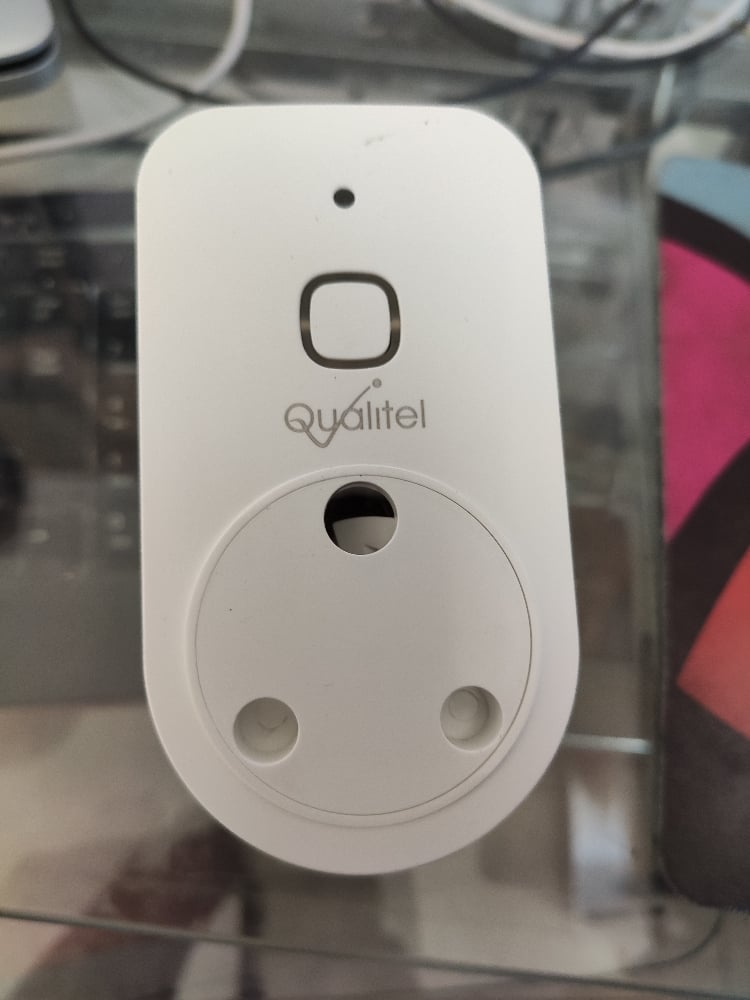
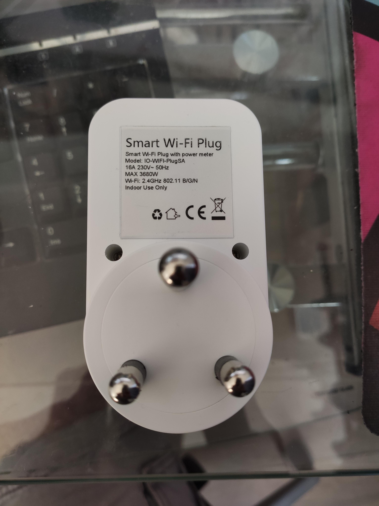
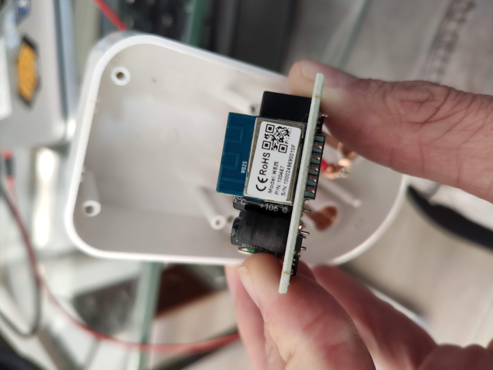
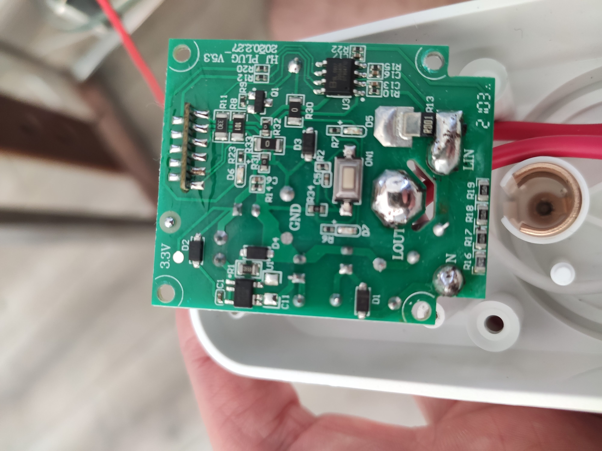
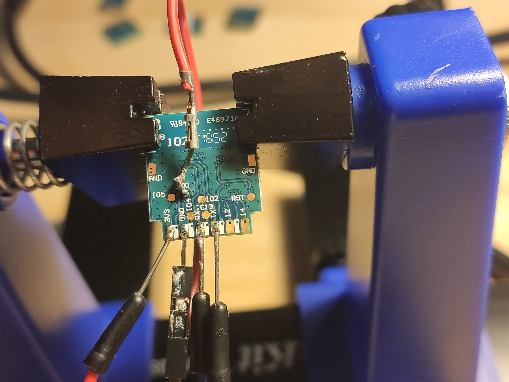
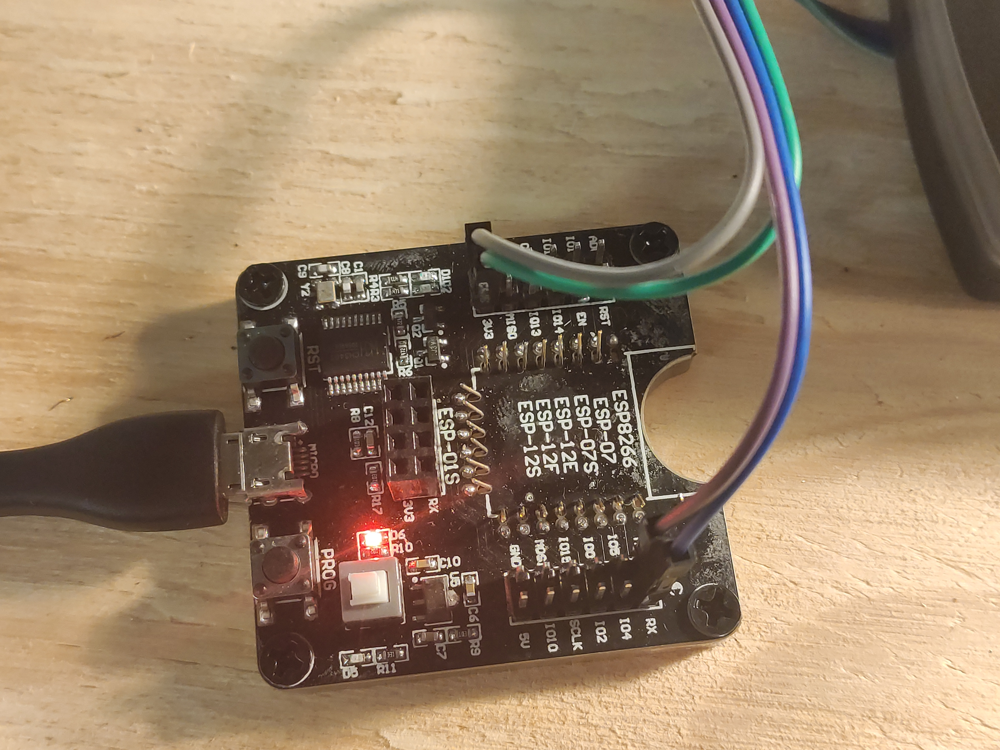

Let's start.

### 🔩 Components

You will need the following components:

* Bneta or Qualitel plug
* ESP-02S module
* [ESP8266 development board][5] or any usb to serial adapter, such as the popular [CH340G USB-Serial Converter][6]

### This is the plug





### 🔩 Flashing Tasmota

First up, let's program our new controller. I am using my [ESP8266 development board][5] here because it works, however I am using the pins as you can do with any other usb ttl device.

Soldering before we can program:


The programmer:


Using the [esptool][6] from Github, this is the command I used after downloading the Tasmota firmware binary.

```bash
esptool.py --port /dev/cu.usbserial-A9UD533R write_flash 0x00000 Downloads/tasmota.bin
```


### Configuration

I used the following template to configure the device for Tasmota:

```
{"NAME":"BNETA WifiPlug","GPIO":[0,288,0,32,2688,2656,0,0,2624,544,224,0,0,0],"FLAG":0,"BASE":18}
```

### Calibration

The power metering also needs to be calibrated. The Tasmota documentation cover [power monitoring calibration][8] in detail, however I found that using a [greasemonkey script][9] in Tampermonkey to really fine tune this perfectly and basically, automates the calibration process apart from a few stemps, which I will quickly outline.

1. Install tamper monkey in Chrome.
2. Install the [greasemonkey script][9] in Tampermonkey
3. Modify this script to whatever you will use. For example my bulb is rated 70w at 240v. So I had to put this into the script. The calibration is done based on this and the readings it get, real time. 
4. Have a way to read your current voltage from your power provider as accurate as possible. I read it from my solar inverter.
5. Run these commands on the tasmota device in the console 
   ```
   VoltageSet 233.3
   PowerSet 70.0
   Backlog VoltRes 3; WattRes 3; CurrentSet 300.171526586620926
   ```
ps. VoltageSet is the voltage you read from your meter. So sometimes I
type in 235.2 or 237.8 depending on whatever eskom is pushing into the
house or if you on solar what the inverter is pushing into your house.
The other commands are also in the script telling you what to do.
pps. You need to work out the CurrentSet according to whatever you are
using. There is a formula in the script.

6. I then click on the calibrate button and wait for it to do it's thing. Usually done within less than 2-3 minutes.

Have fun and enjoy automating!

[0]: Linkslist

[5]: https://www.banggood.com/ESP8266-Test-Board-Burner-Development-Board-WIFI-Module-For-ESP-01-ESP-01S-ESP-12E-ESP-12F-ESP-12S-ESP-18T-p-1684992.htmlp=DX050122090268201806&custlinkid=2697172
[6]: https://www.robotics.org.za/index.php?route=product/product&product_id=2499
[7]: https://github.com/espressif/esptool
[8]: https://tasmota.github.io/docs/Power-Monitoring-Calibration/
[9]: https://github.com/arendst/Tasmota/issues/5484

[xxx]: https://www.aliexpress.com/w/wholesale-esp%2525252d02s.html?catId=0&initiative_id=SB_20230124220456&origin=y&SearchText=esp-02s&spm=a2g0o.detail.1000002.0&dida=y

[x1]: https://mybroadband.co.za/forum/threads/sa-smart-plugs-that-can-be-flashed-with-tasmota.1075323/page-27#post-29951884
[x2]: https://mybroadband.co.za/forum/threads/sa-smart-plugs-that-can-be-flashed-with-tasmota.1075323/page-28#post-30039425
