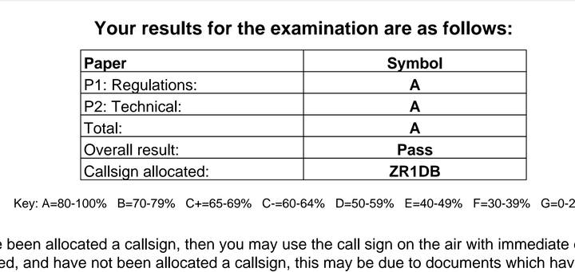
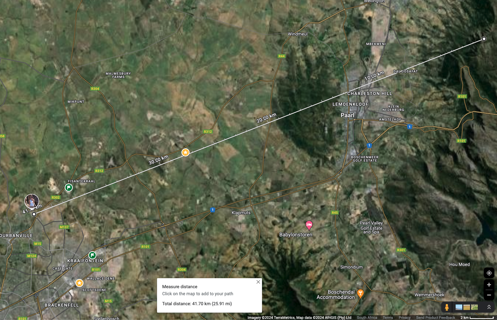
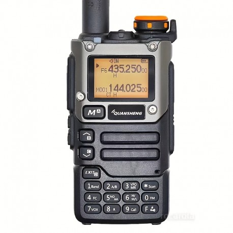

I am serious. It is easier than you think it is, to get an amateur radio license (for those interested)

Earlier this year, I signed up to write the radio amateur radio exam (RAE).

To ensure I am successful, I also joined the RAE course of one of the clubs. I reached out to both BARK and CTARC. Both clubs responded really quick to be honest, however because BARK provided the classes in Afrikaans and lucky also cost a lot less for the course I chose them. This included a year membership to the club, so BONUS!
The classes were online on zoom, every Tueday night 7-9pm. Schedule is on their website: https://bark.org.za/kursus-rae/
This got me through the handbook's work (over 300 pages).
Then after that, I just practiced the flash cards on https://www.weprepare.co.za and that is what allowed me to get the below score.

* On 11th May 2024 did the HF assessment with the club. Met a bunch of people and it was great outing.
* On the 18th May wrote the exam.
* On the 25th May received the exam result.

I definitely didn't expect to get an A for this. The work in the handbook seemed freakishly complex, although very interesting to refresh what I learned in school and then some more that is applicable to the hobby. That said, the exam was definitely easier than I expected. Compared to some of the questions in the handbook, definitely doable for most citizens.

* On the 26th May, I was out to a park in my suburb, to ensure I get line of sight to test contacting on a repeater, on which the club bulletin was on.

Using my little Quansheng UV-K5 hand held radio, reached a repeater that is 41.70km away from me.

Off to the start of new a fun hobby!